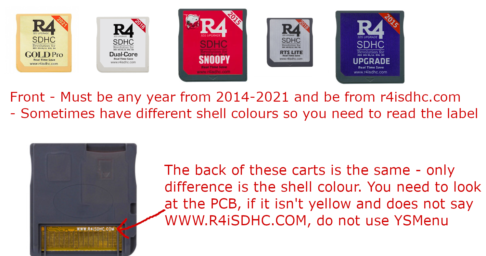
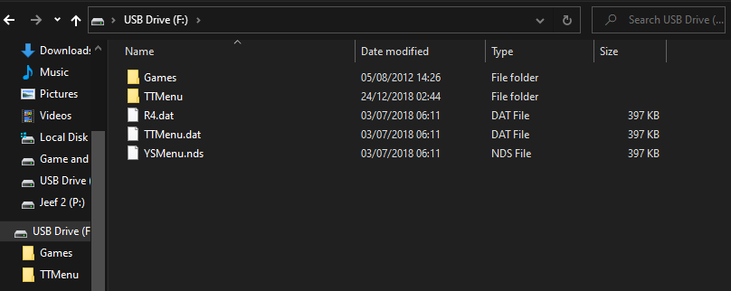

# **r4isdhc.com**

!> The domain for r4isdhc.com expired on the 28th of December, 2022. Which is why you cannot download your kernel from the official site.

Keep in mind that these carts are unrelated to r4i-sdhc.com, despite their very similar names, they are different carts by different manufacturers. If you try to use a kernel from r4i-sdhc.com, you will get the fake cart error on 2014+ carts, or potentially brick the pre-2014 carts.

These are not ace3ds+ clones either, meaning you cannot use the kernel from r4isdhc.com.cn

Anyways, onto the guide! For each version of r4isdhc.com's carts, I will give you steps that show how to identify them. This way, you will not accidentally brick your cart by using an unsupported kernel

## 2014-2021 Carts

Almost every cart from 2014 to 2021 are the exact same. A DSTT clone with a timebomb. Timebombs are not scary, [see here](../timebomb.md) for more information. There have been cases where pre-2014 carts have been given a 2014 label - extremely rare, but it has happened. Which is why it is important to follow the identification steps:

1. The website on the label should say 'r4isdhc.com' near the bottom
2. The year number in the top right of the label should be a small red band with any year between 2014-2021 written on it
3. Underneath the SDHC text, it should say 'Revolution for 3DS DSi XL/LL DSL DS'.
4. The back of the cart should be a yellow pcb, with WWW.R4iSDHC.COM written above the contact pins. If this is any different, it is not a 2014-2021 r4isdhc.com cart

If your cart matches this description, then it can safely use YSMenu. YSMenu is an alternative to the stock kernel for this cart. It is preferred as it does not have a timebomb! However, I have included instructions for the timebomb kernel. **Beware though that the timebomb will trigger on 03/09/2024**

### 2014-2021 YSMenu

It is recommended to use YSMenu on this cart as it does not have a timebomb. The only drawback to using YSMenu is that there is no support for RTS. Another drawback is that I am not allowed to rehost the correct files for YSMenu.

So instead, follow this quick step by step to installing YSMenu on your cart:

1. Download Retrogamefan's multicart update from gbatemp: [https://gbatemp.net/download/retrogamefan-multi-cart-update.35737/](https://gbatemp.net/download/retrogamefan-multi-cart-update.35737/)
2. Open or Extract the multicart's .7z archive
3. Go into the multicart folder, then into the R4i-SDHC YSMenu folder
4. Extract (or copy) every file in this folder to the root of your micro SD card. In the end, the files on your micro SD card should look like this:

#### 2014-2021 Twilight Menu ++

See the instructions on the ds-homebrew wiki on how to install twilight menu: [https://wiki.ds-homebrew.com/twilightmenu/installing-flashcard](https://wiki.ds-homebrew.com/twilightmenu/installing-flashcard)

You should have YSMenu installed before proceeding. While game compatibility is getting better with nds-bootstrap for flashcarts, it's not fantastic. Fortunately, twilight menu ++ allows you to choose between YSMenu and nds-bootstrap. Meaning you can play supported DSiWare with nds-bootstrap, while maintaining YSMenu's game compatibility!

This is also great for people who do not want the timebomb kernel, but think YSMenu looks ugly

### 2014-2021 Timebomb kernel

Since the r4isdhc.com website is dead, you can find the original timebomb kernel from the flashcard archive: [https://flashcard-archive.ds-homebrew.com/YSMenu/r4isdhc.com/r4isdhc.com_2014-2020_DEMON_4.0b.zip](https://flashcard-archive.ds-homebrew.com/YSMenu/r4isdhc.com/r4isdhc.com_2014-2020_DEMON_4.0b.zip)

Once you have downloaded the kernel, it is as simple as extracting it to the root of your micro SD card! As previously mentioned though, the timebomb will trigger on 03/09/2024

## 2013 Carts / Dual Core with no year number / "NEW" Carts

!> These carts will brick if you attempt to use YSMenu on them, this has happened before many times which is why it is important to correctly identify your carts

## RTS Lite with no year number

Remember what I said about 2014-2021 carts being the only carts (by r4isdhc.com) to use YSMenu. Well, that's not 100% true. This cart will use YSMenu too, but not the same version of YSMenu the timebomb carts use.

!> This section does **not** include the RTS Lite "New" carts, see the previous section on how to set those carts up.

The cart should look like this:

Photo from Alin_B on GBATemp

Make sure that this is what your cart looks like before proceeding.

1. Download Retrogamefan's multicart update from gbatemp: [https://gbatemp.net/download/retrogamefan-multi-cart-update.35737/](https://gbatemp.net/download/retrogamefan-multi-cart-update.35737/)
2. Open or Extract the multicart's .7z archive
3. Go into the multicart folder, then into the DSTTi Clone YSMenu folder
4. Extract (or copy) every file in this folder to the root of your micro SD card.
5. Make a copy of TTMenu.dat, then rename the copy to R4.dat

## Christmas Edition

I find this cart funny, not with any weird software or anything, just the idea of a "Christmas Edition" makes me laugh a little

The cart should look like this:

(image placeholder)

Make sure that this is what your cart looks like before proceeding.

1. Download your kernel from the flashcard archive: [https://flashcard-archive.ds-homebrew.com/YSMenu/r4isdhc.com/r4isdhc.com_Christmas_Edition_Limited_SDHC_Kernel_1.17B.zip](https://flashcard-archive.ds-homebrew.com/YSMenu/r4isdhc.com/r4isdhc.com_Christmas_Edition_Limited_SDHC_Kernel_1.17B.zip)
2. Extract the kernel to the micro SD card.
3. Next, download Retrogamefan's multicart update from gbatemp: [https://gbatemp.net/download/retrogamefan-multi-cart-update.35737/](https://gbatemp.net/download/retrogamefan-multi-cart-update.35737/)
4. Open or Extract the multicart's .7z archive
5. Go into the multicart folder, then into the R4 Clone YSMenu folder.
6. Extract (or copy) every file in this folder to the root of your micro SD card
7. When you launch your cart, open YSMenu.nds!

You can use the "Christmas" kernel as is, but YSMenu is newer which is why I suggest using it. Every time you boot your cart, you will have to open YSMenu.nds to boot into YSMenu.

## Original r4isdhc.com

This looks like the r4i-sdhc.com carts, but instead of r4i-sdhc.com, it has r4isdhc.com written on it.

This is what the cart looks like:

Make sure that this is what your cart looks like before proceeding.

This is very simple, just download the kernel from the flashcard archive: [https://flashcard-archive.ds-homebrew.com/r4isdhc.com/r4isdhc.com_Original_Kernel_1.19B.zip](https://flashcard-archive.ds-homebrew.com/r4isdhc.com/r4isdhc.com_Original_Kernel_1.19B.zip)

Then extract it to the root of your micro sd card. I do not think this cart supports YSMenu, so this is the most up to date kernel you could use unfortunately. And after talking with someone who has this cart, game compatibility isn't fantastic either.

## r4isdhc.com RTS Black

This cart can also use YSMenu thanks to lifehackerhansol, see this page for more details: [https://gbatemp.net/threads/release-itouchds-complete-kernel-replacement.607421/](https://gbatemp.net/threads/release-itouchds-complete-kernel-replacement.607421/)

The cart should look like this:

(image placeholder)

Make sure that this is what your cart looks like before proceeding.

1. Download Retrogamefan's multicart update from gbatemp :[https://gbatemp.net/download/retrogamefan-multi-cart-update.35737/](https://gbatemp.net/download/retrogamefan-multi-cart-update.35737/)
2. Open or Extract the multicart's .7z archive
3. Go into the multicart folder, then into the M3Real_M3iZero YSMenu folder
4. Extract (or copy) every file from this folder to your micro SD card
5. Download the ysmenu bootstrap for this cart from here: [https://gbatemp.net/download/m3-ds-real-itouchds-complete-kernel-replacement.37368/](https://gbatemp.net/download/m3-ds-real-itouchds-complete-kernel-replacement.37368/) **Make sure to download the YSMenu verion**
6. Extract the bootstrap .zip to the root of your micro SD card

And now you should be booting into YSMenu!
