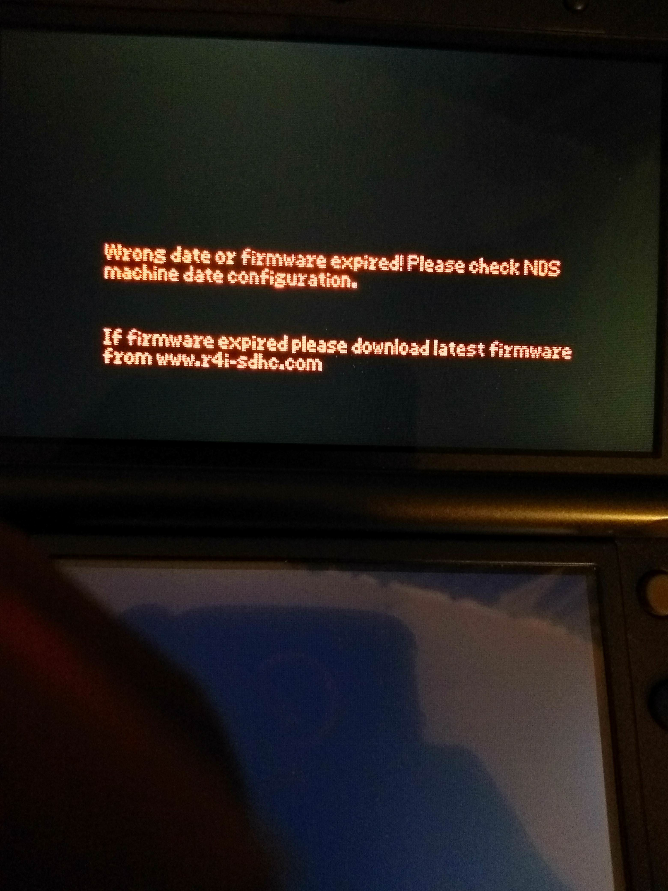

<h1>Timebombs are not as scary as people make them out to be!</h1>

Many people seem to have the wrong idea about timebombs and how they function. I think a part of that was due to the Gateway3DS incident

## Which carts have timebombs?

A small handful! But if that's the case, why is it talked about so much?

Well, the timebomb carts ended up being popular carts! A few years ago, if you looked for a new R4 card on eBay, you would be greeted with the 2014+ timebomb carts from r4isdhc.com. I'm not talking like 2 listings of carts, the entire page would be filled with timebomb cart listings!

Carts from these manufacturers included timebombs in their stock kernel:

* r4isdhc.com (2014+ carts only)
* r4i-sdhc.com carts
* r4i-gold.com carts (versions: v1.4-1.4.4)
* r4i-gold.eu carts
* [The timebomb clone carts, red pcb with 4 dots on the contact pins](https://i.imgur.com/8vQjh5R.png)

As I said, small handful of manufacturers, but it's true that they were very popular carts!

## How do timebombs really work?

Timebombs are built into the stock kernel of the carts that include them. If you are using the kernel which the manufacturer of a timebomb cart provides, you will see that after a specific date has passed, the cart will give you an error in spooky red text!

Here is a picture of this super scary error:

Photo from HomebrewJay on GBATemp

But that's all it does, prevent the cart from loading after a specific date.

* It does not brick the cart
* It does not prevent the cart from being seen by the console
* It does not delete files on your micro SD card
* It does not damage your console

There are ways around this on the affected carts:

* Set your date and time to before the timebomb. Most people set their date and time back to 2009, it shouldn't cause major issues unless you want to be in the current year
* Install YSMenu - Timebomb carts are usually supported by YSMenu, though double check this is the case before installing. Some people do not like the look of YSMenu, if that's the case for you, either change the skin or;
* Install Twilight Menu ++ - You need to install YSMenu first, but after that, you can follow the instructions [found here](https://wiki.ds-homebrew.com/twilightmenu/installing-flashcard) to install twilight menu onto your flashcart

But I think I have somewhat proven my point, timebombs aren't as scary as people think, it's just a small message telling you to update

### Why do timebombs exist?

To be honest, there isn't really a clear answer. I've heard theories that it's to make more money - people see the error and think the cart is broken so they buy a new one

Or it could just be a reminder to update - where in some cases the update is never provided - who knows

## The Gateway3DS incident

This is what confuses most people about timebombs, so I'll try to explain how this isn't the case

Gateway3DS was one of the first 3DS Flashcards you could buy! It came in two parts, a blue DS Flashcart and a red 3DS Flashcart. In order to use the red cart, you would insert the blue flashcart and run the exploit

This exploit would abuse a flaw in the DS profile of the 3DS, this was later patched, but it worked on the latest firmware for the 3DS at that time. This exploit would allow the red cart to be booted with no issue

In version 2.0b2 for Gateway carts, anti-clone code was added which would brick your console if you used a cloned Gateway cart. This didn't work well as it ended up bricking legitimate users consoles too

The next update fixed this, but the damage was done

Though as you can see, this wasn't any fault of a timebomb, just badly written DRM. However, this got confused with timebombs somewhere down the line.

## Conclusion

Timebombs aren't scary :)
